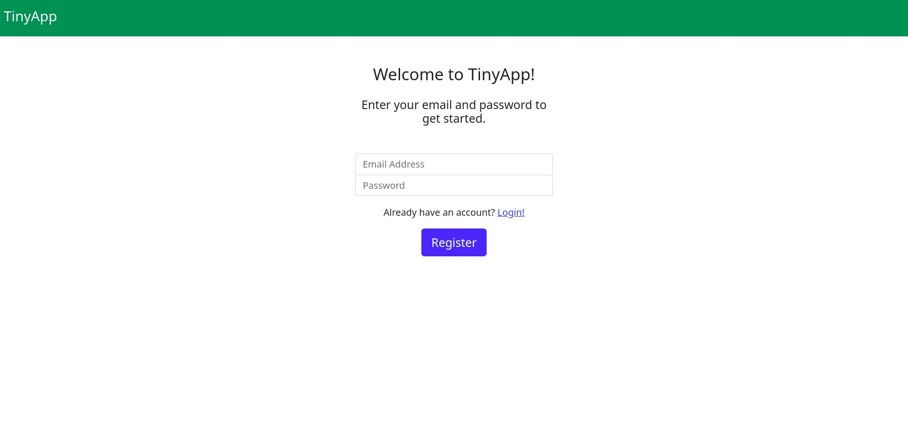
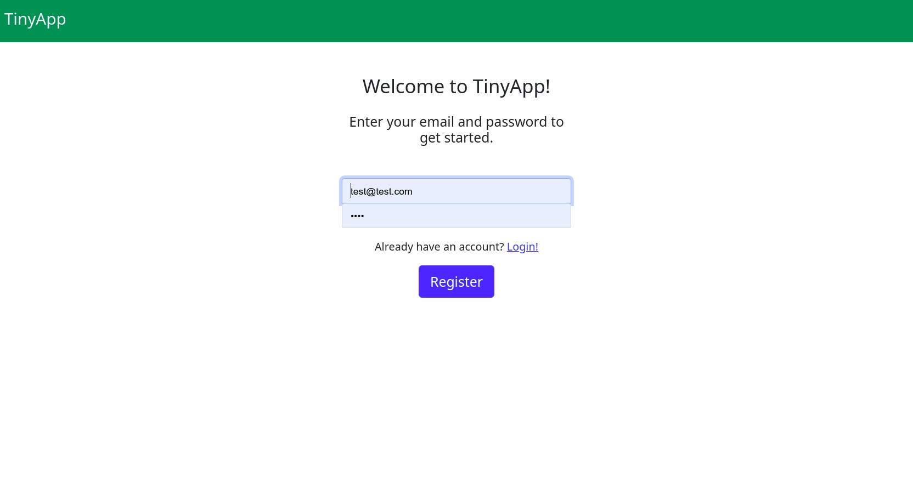

# TinyApp Project

TinyApp is a full stack web application built with Node and Express that allows users to shorten long URLs (à la bit.ly).

## Final Product

<<<<<<< HEAD

=======

>>>>>>> 54b0d64c4396a9f32366b0048d3cd3f4b016bbb8

## Dependencies

- Node.js
- Express
- EJS
- bcrypt
- body-parser
- cookie-session

## Getting Started

- Install all dependencies (using the `npm install` command).
<<<<<<< HEAD
- Run the development web server using the `node express_server.js` command.
=======
- Run the development web server using the `node express_server.js` command.
>>>>>>> 54b0d64c4396a9f32366b0048d3cd3f4b016bbb8
